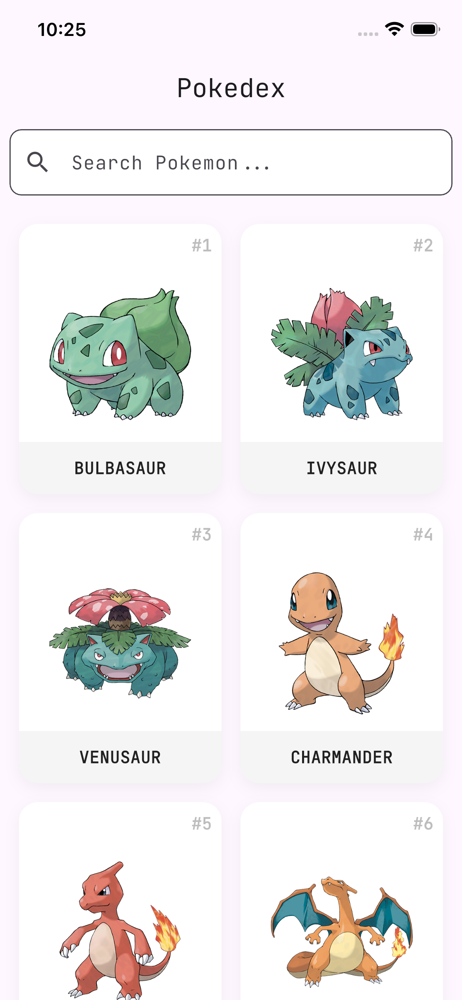
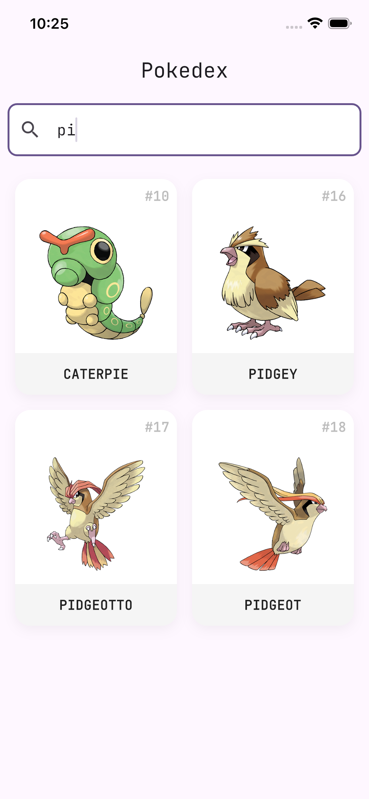
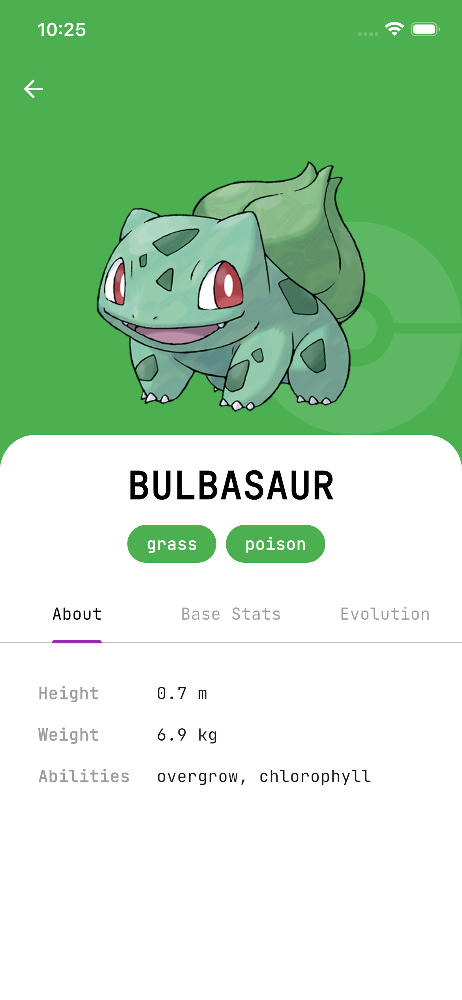
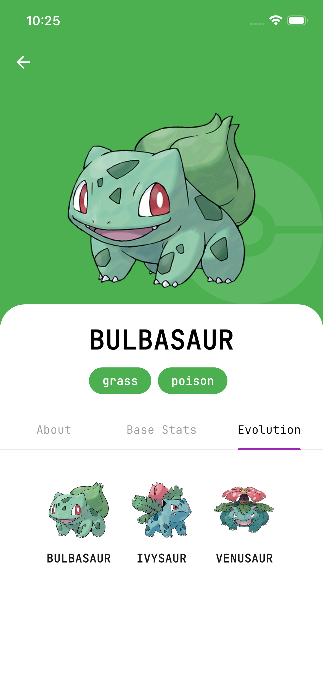

# PokeApp 📱

A modern, feature-rich Pokedex application built with Flutter, demonstrating Clean Architecture, BLoC state management, and offline capabilities.

 <!-- Replace with actual banner if available -->

## ✨ Features

- **Pokemon List**: Browse a comprehensive list of Pokemon with infinite scrolling pagination.
- **Search**: Instantly search for Pokemon by name or ID.
- **Detailed View**: View detailed information including stats, physical attributes, types, and stats.
- **Offline Support**: Browse previously visited content even without an internet connection using Hive caching.
- **Connectivity Handling**: Real-time network status monitoring with user feedback.
- **Responsive Design**: Optimized for different screen sizes.

## 📸 Screenshots

| Home | Search | Detail | Evolutions |
|:---:|:---:|:---:|:---:|
|  |  |  |  |

## 🛠️ Tech Stack & Architecture

This project follows **Clean Architecture** principles to ensure separation of concerns, testability, and scalability.

- **Language**: [Dart](https://dart.dev/)
- **Framework**: [Flutter](https://flutter.dev/)
- **State Management**: [flutter_bloc](https://pub.dev/packages/flutter_bloc) (Cubit)
- **Architecture**: Clean Architecture (Presentation, Domain, Data layers)
- **Navigation**: [go_router](https://pub.dev/packages/go_router)
- **Networking**: [dio](https://pub.dev/packages/dio) with [internet_connection_checker_plus](https://pub.dev/packages/internet_connection_checker_plus)
- **Local Storage**: [hive](https://pub.dev/packages/hive)
- **Dependency Injection**: [get_it](https://pub.dev/packages/get_it)
- **Testing**: [mocktail](https://pub.dev/packages/mocktail), [bloc_test](https://pub.dev/packages/bloc_test)

## 📂 Project Structure

```
lib/
├── core/                   # Core functionality (DI, Network, Config, Shared Widgets)
├── features/               # Feature-based modules
│   ├── pokemon_list/       # List feature (Data, Domain, Presentation, Services)
│   └── pokemon_detail/     # Detail feature (Data, Domain, Presentation, Services)
└── main.dart               # Entry point
```

## 🚀 Getting Started

### Prerequisites

- [Flutter SDK](https://docs.flutter.dev/get-started/install) (latest stable version recommended)
- [Dart SDK](https://dart.dev/get-dart)

### Installation

1.  **Clone the repository**:
    ```bash
    git clone https://github.com/laraveloper96/flutterPokeApp.git
    cd flutterPokeApp
    ```

2.  **Install dependencies**:
    ```bash
    flutter pub get
    ```
    
### ▶️ Running the App

The application requires environment variables to be defined for API endpoints.

**Using default PokeAPI:**

```bash
flutter run --dart-define=BASE_URL=https://pokeapi.co/api/v2/ --dart-define=BASE_URL_IMAGE=https://raw.githubusercontent.com/PokeAPI/sprites/master/sprites/pokemon/other/official-artwork/
```

| Variable | Description | Example Value |
| :--- | :--- | :--- |
| `BASE_URL` | The Base URL for the Pokemon API | `https://pokeapi.co/api/v2/` |
| `BASE_URL_IMAGE` | Base URL for fetching Pokemon images | `https://raw.githubusercontent.com...` |

## 🧪 Testing

To run unit and widget tests:

```bash
flutter test
```

## 🤝 Contributing

Contributions are welcome! Please feel free to submit a Pull Request.

1.  Fork the project
2.  Create your feature branch (`git checkout -b feature/AmazingFeature`)
3.  Commit your changes (`git commit -m 'Add some AmazingFeature'`)
4.  Push to the branch (`git push origin feature/AmazingFeature`)
5.  Open a Pull Request

## 🤔 Preguntas y Respuestas (Q&A)

### ● Arquitectura y escalabilidad: ¿Qué arquitectura/patrón usaste y por qué es adecuado para escalar a un producto real (incluyendo Web)?

Utilicé **Clean Architecture** dividida en capas:
- **Presentation**: UI (Widgets) y Lógica de Estado (Cubits/Blocs).
- **Domain**: Entidades, UseCases y Definiciones de Repositorio (abstractas). Es el núcleo puro de Dart, sin dependencias de frameworks externos.
- **Services**: Implementaciones de Services (Local/Remote).

**Por qué escala:**
1.  **Independencia**: Cambiar la UI (ej. a Web o Desktop) o la base de datos (ej. de Hive a SQLite) no afecta la lógica de negocio (Services).
2.  **Testabilidad**: Al desacoplar dependencias, cada capa se puede probar aisladamente con Mocks.
3.  **Modularidad**: Facilita que múltiples desarrolladores trabajen en diferentes "features" sin colisiones.

### ● ¿Qué trade-offs tomaste por el timebox de 1 día?

1.  **Tests de Integración**: Prioricé Unit Tests (Cubit) y Widget Tests básicos sobre pruebas de integración completas (E2E) que consumen más tiempo de configuración.
2.  **Manejo de Errores Granular**: Se implementó un manejo de errores robusto pero genérico (`AppErrorView`). En un producto real, habría errores específicos para diferentes códigos HTTP o estados de conectividad.
3.  **Internacionalización (l10n)**: Los textos están hardcodeados en inglés para agilidad; lo ideal sería usar archivos ARB.

### ● Gestión de estado y side-effects: Describe tu flujo "UI → estado → datos" y cómo evitas acoplamiento entre capas.

**Flujo:**
1.  **UI**: El usuario hace scroll -> llama a `cubit.loadPokemonList()`.
2.  **Cubit**: Emite estado `Loading` -> invoca al UseCase `GetPokemonList`.
3.  **UseCase**: Orquesta la decisión de fuente de datos (Remote vs Local) usando `NetworkInfo`.
4.  **Data**: Retorna un resultado (`Either` o `Record`) encapsulando Éxito o Fallo.
5.  **Cubit**: Recibe el resultado y emite `Loaded(data)` o `Error(message)`.
6.  **UI**: `BlocBuilder` reacciona al cambio de estado y actualiza la vista.

**Desacoplamiento:**
- Uso de **Inyección de Dependencias** (`get_it`) para que las capas no instancien sus dependencias directamente.
- Los Cubits solo conocen los UseCases, no los Repositorios ni las fuentes de datos.

### ● Offline y caché: Explica tu estrategia de persistencia: qué guardas, cómo versionas/invalidas, cómo resuelves conflictos entre "dato cacheado" y "dato remoto".

**Estrategia: Network First con Fallback a Cache (Offline-first capability)**
- **Qué guardo**: La lista completa de Pokemon (JSON simplificado) y detalles visitados en una caja de **Hive**.
- **Lógica**:
    - Si hay internet: Se descarga la data, se muestra al usuario y **se actualiza** silenciosamente el caché local (agregando nuevos items sin duplicados).
    - Si NO hay internet: Se lee directamente de Hive, soportando la misma paginación (offset/limit) simulada localmente.
- **Conflictos**: La "verdad" siempre es la API remota. El caché actúa como una copia de respaldo acumulativa. No se implementó invalidación por TTL (Time To Live) por simplicidad, pero sería el siguiente paso.

### ● Flutter Web: ¿Qué decisiones tomaste para que la experiencia en Web sea buena? ¿Qué limitaciones tuviste/anticipas?

**Decisiones:**
- **Diseño Responsivo**: Uso de `GridView` con `maxCrossAxisExtent` (200px) en lugar de un `count` fijo. Esto permite que en móviles se vean 2 columnas y en Web/Desktop se expanda a n-columnas automáticamente.
- **Navegación**: Uso de `go_router` para manejo adecuado de URLs profundas (`/detail/1`).

**Limitaciones/Mitigaciones:**
- **Imágenes y CORS**: `CachedNetworkImage` puede fallar en Web si el servidor de imágenes no permite CORS (común con PokeAPI sprites).
    - *Mitigación*: En prod, usar un proxy de imágenes o configurar el renderizador `html` de Flutter (`--web-renderer html`) si es crítico.
- **Performance de Listas**: Listas infinitas en Web pueden ser pesadas.
    - *Mitigación*: Paginación eficiente y optimización de widgets de imagen.

### ● Calidad: Menciona 3 decisiones de "código limpio" aplicadas.

1.  **Sealed Classes para Estados**: (`PokemonListState`) Permite un manejo exhaustivo de estados en la UI, reduciendo bugs de estados no controlados.
    ```dart
    sealed class PokemonListState extends Equatable { ... }
    ```
2.  **Single Responsibility en UseCases**: Cada clase de dominio hace exactamente una cosa (`GetPokemonList`, `GetPokemonDetail`), facilitando su lectura y testeo.
3.  **Separación de Modelos y Entidades**: `PokemonModel` (Data, con `fromJson`) es distinto de `Pokemon` (Domain, pura). Esto previene que cambios en la API rompan la lógica de negocio.

### ● Testing: ¿Qué testeaste y por qué? Si no alcanzaste, ¿qué tests agregarías primero?

- **Qué testeé**:
    - **Unit Tests (Cubits)**: Lógica crítica de negocio. Verificar que ante éxito/fallo del repositorio, la UI reciba los estados correctos.
    - **Widget Tests**: Verificar que `PokemonComponent` renderice carga, lista y error visualmente.
- **Prioridad siguiente**:
    - **Golden Tests**: Para asegurar que pixel-perfect UI no se rompa entre refactorizaciones.
    - **Integration Tests**: Probar el flujo completo "Abrir App -> Scroll -> Click -> Detalle" en un emulador.

### ● Git: ¿Cómo estructuraste tus commits?

Utilicé **Conventional Commits** para mantener un historial semántico y legible:
- `feat`: Nuevas características.
- `fix`: Corrección de errores.
- `refactor`: Cambios de código que no alteran funcionalidad.
- `docs`: Cambios en documentación.
- **Granularidad**: Commits pequeños y atómicos (una tarea lógica por commit) para facilitar Code Reviews y `revert` si fuera necesario.

### ● Pendientes: ¿Qué dejaste fuera? Lista priorizada (top 3-5).

1.  **Implementar filtros**: Implementar filtros en el `BottomSheet` para buscar "Solo Fuego" o "Velocidad > 50".
2.  **Implementar sistema de Favoritos**: Persistencia local de "Me Gusta" independiente del caché.
3.  **Implementar animaciones Hero Complejas**: Mejorar la transición de la imagen del listado al detalle para que sea más fluida.
4.  **Implementar tema dinámico**: Extraer colores de la imagen del Pokemon para teñir la UI (usando `palette_generator`).
5.  **Implementar traducción**: Traducir la app al español/ingles.
6.  **Implementar una arquitectura granular**: Implementar una arquitectura granular para que sea más fácil de mantener y escalar.

